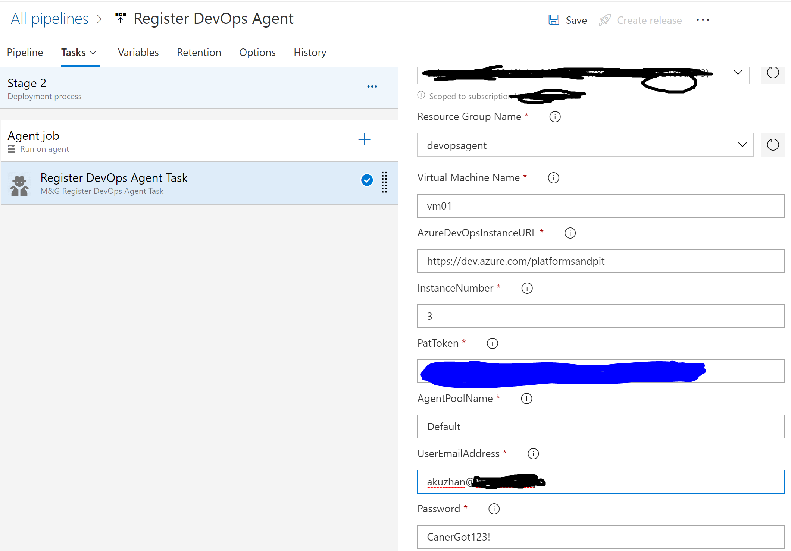

# Azure DevOps Agent Register Task 
An extension to deploy Azure DevOps Agent. It requires vm to have Devops Agent in C:>Program Files>Microsoft VSTS Agent>InstanceNumber where instanceNumber is a numeric value 1 to 4.

## Release notes

{rel-version}

{rel-content}

## Parameter usage

### Azure Connection Type
Select Azure Resource Manager

### AzureRM Subscription
Select Subscription where you have your vm

### Resource Group Name

name of the resource group vm belongs to

### Virtual Machine Name

Virtual machine name

### AzureDevOpsInstanceURL

Azure DevOps Instance URL -https://dev.azure.com{accountName}

### InstanceNumber

Agent instance number. 1,2,3,4.

### PatToken

Personal Access Token

### AgentPoolName

Agent Pool Name

### UserEmailAddress

An user account. For example abc@xyz.com

### Password

********

## Help & Contact

Experiencing any problems, or do you have an idea? Please let us know. Or even better, fix it yourself and send PR.
